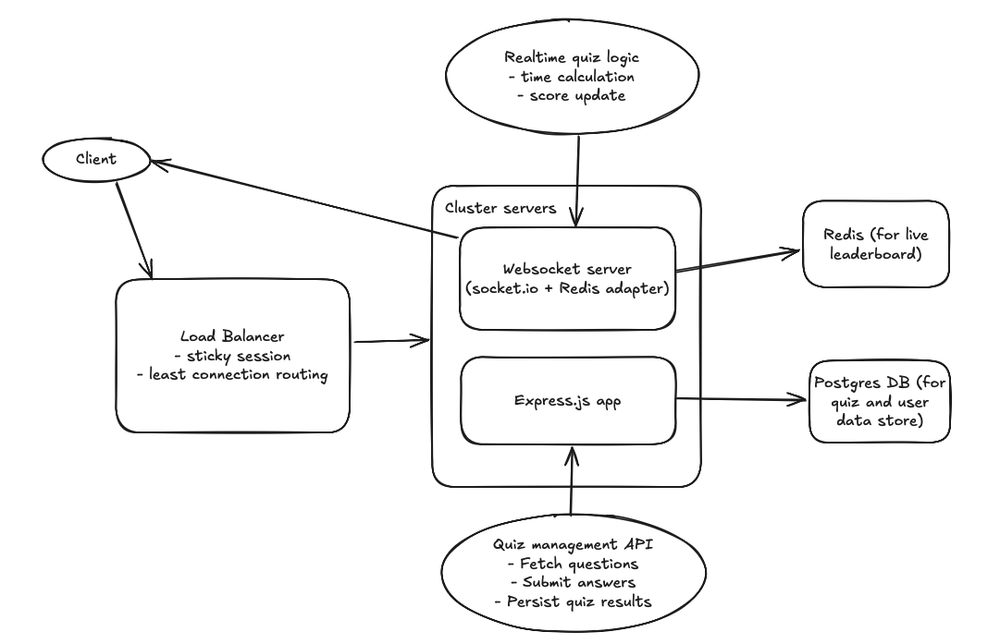
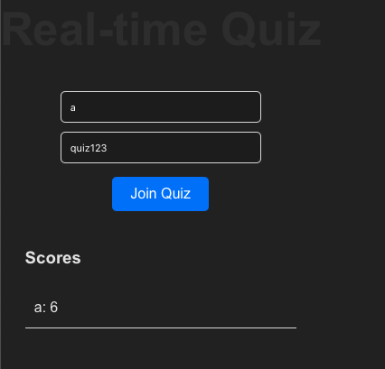

# Overview

This is a learning project to create a technical solution for a real-time quiz feature for an English learning application. This feature will allow users to answer questions in real-time, compete with others, and see their scores updated live on a leaderboard.

# System Design

## Architecture Diagram

- Frontend (Client): React.js for building interactive single page app.
- Backend: Express.js with TypeScript for REST APIs and WebSocket-based with Socket.io and Redis adapter for real-time updates.
- Database: PostgreSQL for storing quiz data, Redis for caching and live leaderboard management.
- Cloud Hosting: AWS for scalable infrastructure.



## Component description

1. Frontend (Client):

- Connects to the WebSocket server for real-time updates on the quiz and leaderboard.
- Fetches questions and posts answers through REST APIs.

2. WebSockets Server:

- Manages the real-time communication between the users and the backend.
- Updates the leaderboard live as users submit answers.
- Manages quiz state (timers, score, active participants, etc.).

3. REST API:

- Handles CRUD operations for quizzes, users, and leaderboard data.
- Fetches the questions for each quiz round from the database.
- Submits the user’s answers to be processed.

4. Real-Time Quiz Logic:

- Contain main business logic such as timing, score calculation, and answer validation.
- Updates Redis with the real-time leaderboard and manages active players’ data.

5. Redis:

- Used for storing and retrieving the live leaderboard data, reducing the load on the database.
- Keeps track of active participants and their current scores.

6. PostgreSQL:

- Stores all persistent data, including questions, answers, users, quiz results, etc.

## Data Flow

1. User Joins

- The user logs into the app and joins a quiz session.
- The WebSocket connection is established with the server.
- The WebSocket server sends the initial quiz data (e.g., number of questions, current leaderboard) to the user.

2. Quiz Starts

- The quiz server sends questions to all connected users simultaneously via WebSocket.
- A timer is managed on both the server and client to sync the quiz round duration.

3. User Submits Answer

- The answer is sent to the WebSocket server.
- The WebSocket server places the answer in a Redis queue for async processing.

4. Answer Processing

- The backend fetches the user’s answer from the Redis queue to validate and give scores.
- The score is updated in Redis (leaderboard).

5. Leaderboard Update

- The live leaderboard is continuously updated to the frontend via WebSocket from Redis.
- Users can see the updated scores and ranks in real-time.

6. Quiz Ends

- Final scores are calculated and stored persistently in PostgreSQL.
- The user’s quiz history performance can also be saved for future analytics.

## Technology and Tools

1. Frontend:

- React with Vite: For the interactive UI, handling real-time updates with WebSockets.
- WebSocket API: For real-time communication between clients and server.

2. Backend:

- Express.js with TypeScript: For handling both REST API and WebSocket communication.
- Socket.io: For low-latency, bidirectional and event-based communication between a client and a server. It adds an abstraction on websockets transport with additional features like reconnection, broadcasting, etc.
- Redis adapter: Used with Socket.io to make use of Redis pub/sub mechanism.
- Redis: To store real-time leaderboard data with high-speed access.
- PostgreSQL: For storing quiz questions, users, and scores.

3. Infrastructure:

- Docker and AWS ECR: For containerizing the backend services and managing container images.
- AWS Fargate and Application Load Balancer: Cloud hosting solutions for handling dynamic scaling and load balancing.
- Amazon RDS for PostgreSQL: for auto handling backups, monitoring, and scaling.
- Amazon ElastiCache for Redis: for managing Redis clusters.

# Implementation

The project will use `npm workspace` as a monorepo for both backend and frontend apps.

```
├── README.md
├── apps
│   ├── backend
│   └── frontend
├── assets
│   └── system.png
```

And for the simplicity of a demo, I only implement a core feature which is Real-time Score Updates: Users' scores should be updated in real-time as they submit answers.

So the frontend will be a simple page built with React to allow user to input `userId` and `quizId`, click Join Quiz button and see the latest scores.



The action of submitting answer will be done through a POST endpoint `/api/submit-answer` to call to the backend to calculate score for user.

```
// sample payload
{
    "quizId": "quiz123",
    "userId": "a",
    "questionId": "question1",
    "answerId": "answer3"
}
```

# Walkthrough Video

- Technical overview: [](https://www.loom.com/share/4d600cb5da6545478f4cf3474a0460b8?sid=b187862e-a89d-4449-8ab4-812fb1eac967)
- Implementation: [](https://www.loom.com/share/254e5f8f3c3548fa8b322f1ac5ecaebc?sid=b8447da1-eba1-46c5-88ac-bc0afcd42d86)
<div style="position: relative; padding-bottom: 56.25%; height: 0;"><iframe src="https://www.loom.com/embed/254e5f8f3c3548fa8b322f1ac5ecaebc?sid=00967e01-009f-46c5-96b4-2a575698abc4" frameborder="0" webkitallowfullscreen mozallowfullscreen allowfullscreen style="position: absolute; top: 0; left: 0; width: 100%; height: 100%;"></iframe></div>
